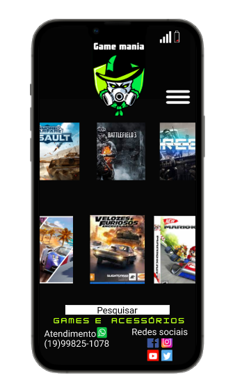

                        <!--largura--> <!--Altura-->
    

---

                        <!--largura--> <!--Altura-->
    

---

                        <!--largura--> <!--Altura-->
    

---
#### O site atendeu as necessidades da(o) cliente especificadas no briefing, por que contém o que foi solicitado, como por exemplo: Logotipo, cor de fundo, interação das redes sociais, fotos dos produtos e ser minimalista de acordo com a necessidade do(a) cliente.
#### Foi aplicado conceito de minimalismo no layout e focado em ser amostrado ao cliente alguns produtos da loja, para a experiência do usuario(UX), a ideia é que onde haja os produtos o usuário pode rolar os produtos para o lado, ou se preferir um produto mais epecífico pode buscar através dos menus, ou no campo de pesquisa nesse modo foi aplicado esses conceitos de UI.

#### As dificuldades encontradas no desenvolvimento dos 3 layouts foram a falta de experiência minha com o figma e também de design, pois esse é meu primeiro protótipo que fiz na vida para essas 3 necessidades, acredito que com mais prática eu possa fazer um layout melhor.
<!--Justificar por que o layout atende às necessidades especificadas pela cliente no briefing.
 - Justificar a aplicação dos princípios de UX, UI e Design Interativo.
Ex.: Por quê o site apresenta usabilidade, é funcional e intuitivo?

- Expor as principais dificuldades encontradas no desenvolvimento dos 3 tipos de layout – desktop, tablet e smartphone.-->
---
#  Muito obrigado !
###-Meus contatos

[whatsapp](https://bit.ly/3uMmzeI)

[Telegram](https://bit.ly/2QjsTeT)

[Instagram](https://bit.ly/3ybr0Sj)

[Linkedin](https://bit.ly/2RU9X6B)

[Facebook](https://bit.ly/33L8m5P)

[Github](https://bit.ly/3ybqALJ)

---
### Tecnologias utilizadas para esta apresentação: 

    

